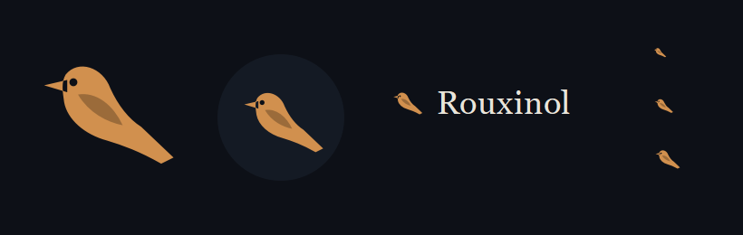
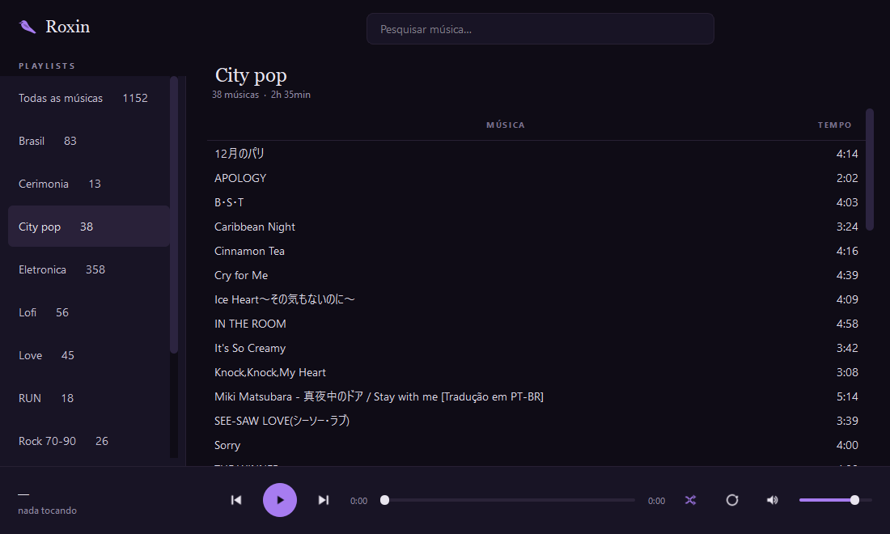
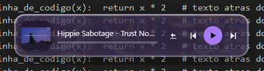
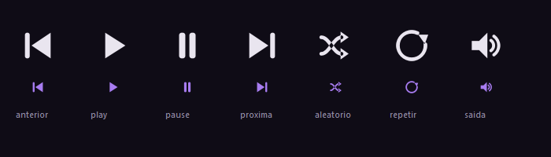

# Roxin

**Player de música de mesa para acervo local, em Windows.** Lê o nome do arquivo,
mostra só nome e duração, e sai da frente.



## Por que ele existe

Um acervo de mil e poucas músicas baixadas ao longo de dez anos, por conversores de
site que morreram desde então. As tags de metadados são lixo: `Unknown` no artista,
nome de canal no lugar do álbum, `youtu.be` no título. Nenhum player lida bem com
isso — ou eles ignoram as playlists `.m3u`, ou enchem a tela com campos vazios que
prometem uma organização que o acervo não tem.

O Roxin parte do oposto: **a única coisa confiável ali é o nome do arquivo.** Então é
isso que ele lê, e é só isso que ele mostra.

## O que ele faz

- Lê playlists `.m3u` e toca **mp3 e m4a** pelos codecs do próprio Windows, via QtMultimedia
- Busca que **ignora acento** — `coracao` acha *Coração de Aço*
- A playlist **dá a volta nela mesma**: acabou a última, volta para a primeira
- Junta numa lista à parte tudo que não está em playlist nenhuma
- **Fila** montada por clique direito, temporária de propósito: fechou o app, zera
- **Capinha quadrada** ao lado de cada faixa, de cache próprio, sem ler tag em tempo de tela
- **Curadoria**: criar, renomear, apagar playlist, reordenar arrastando — com backup a cada reescrita
- **Baixar de um link**, com o motor do [Anzol](https://github.com/SkotAlexsander/anzol) embutido

| Tecla | |
|---|---|
| `Espaço` | tocar / pausar |
| `Ctrl+F` | ir para a busca |
| `Enter` | tocar a faixa selecionada |
| `←` `→` | anterior / próxima |

## Miniplayer de vidro



Quando o Roxin perde o foco, uma janelinha aparece no canto e traz capa, nome,
progresso e três controles. Ela **não rouba o foco** de onde você está digitando
(`WA_ShowWithoutActivating`), não aparece no Alt+Tab (`Qt.Tool`), e desmancha quando
o app volta.

O vidro líquido é uma página WebGL hospedada numa janela Qt transparente. A sombra é
desenhada *dentro* da janela, porque o Windows não pinta nada fora dela — o que impõe
uma regra medida no motor, não na especificação: **deslocamento + blur ≤ margem**.
Ignorar isso é o que produz aquele quadrado de sombra cortado em linha reta.

## Identidade



**Roxin** é rouxinol e roxo na mesma palavra. O rouxinol canta de madrugada — então
não é um app de dia: o fundo é `#0f0c16`, roxo-noite, nunca preto puro, porque preto
puro é vazio e noite tem azul dentro.

O roxo `#a77cf0` é a única cor saturada, e marca **só o que está acontecendo agora**:
o botão de tocar, o trecho já ouvido, a playlist aberta. Se aparecesse em tudo,
deixaria de significar alguma coisa.

A marca fala em serifa (Georgia), a interface fala em sem-serifa (Segoe UI). O pássaro
e os ícones de controle são **vetor desenhado no código**, em `QPainterPath` — não há
arquivo de imagem. Escalam de 16 a 256px sem borrar e mudam de cor sem reexportar nada.
Emoji foi evitado de propósito: o Windows os pinta coloridos e quebra a paleta.

O raciocínio completo está em [`BRANDING.md`](BRANDING.md).

## Rodar

Python 3.11+ e `pip install PySide6`.

```
pythonw Musica.pyw
```

**Ele roda pelo fonte, não por executável.** O Smart App Control do Windows bloqueia
binário novo sem reputação, então o caminho é um atalho para `pythonw`. A vantagem
prática: toda mudança no código vale na próxima abertura, sem reconstruir nada.

### Honestidade sobre o escopo

Isto é software feito para uma máquina — a minha. Os caminhos do acervo estão
**cravados no código**, em `Musica.pyw`:

```python
MUSICA    = r"D:\Music"
PLAYLISTS = r"D:\Music\Playlists"
```

Para rodar em outro lugar, troque essas duas linhas. Não há tela de configuração,
instalador, nem suporte. Está público porque o que foi resolvido aqui pode ser útil a
quem enfrentar os mesmos problemas — acervo sem metadados, capa que não existe,
sobreposição transparente no Windows — não porque seja um produto.

## Testes

As regressões que doeram viraram teste, e rodam offscreen, mudas, sem piscar janela:

```
python testes/teste_loop_playlist.py   # a volta da playlist e de qual lista a faixa veio
python testes/teste_sombra_mini.py     # fotografa a página com canal alfa e reprova borda opaca
python testes/teste_volume_palco.py    # o volume mora num lugar só; o do palco é espelho
python testes/teste_pescaria.py        # status de fim do download vs. trabalho em andamento
```

## Mapa dos arquivos

| | |
|---|---|
| `Musica.pyw` | o app inteiro: dados, interface e player |
| `marca.py` | paleta, o pássaro em vetor, a pintura da barra de título |
| `capas.py` | cache de capinhas a partir da imagem embutida nas músicas |
| `buscar_capas.py` | procura capa quadrada na busca pública da Apple, com conferência manual |
| `mini_vidro.py` · `mini_pagina.py` | a janelinha do miniplayer e seu vidro líquido |
| `anzol/nucleo.py` | motor de download, do Anzol — **com o `LICENSE`, que a MIT exige** |
| [`DECISOES.md`](DECISOES.md) | o diário: cada conserto, o que foi medido e o que custou |
| [`BRANDING.md`](BRANDING.md) | a identidade visual e o porquê de cada decisão |

## Créditos

O motor de download é o **[Anzol](https://github.com/SkotAlexsander/anzol)**, de
**Alex Skot**, sob licença MIT — usado com a permissão dele. Só o `nucleo.py` entra
aqui; a interface Flask/pywebview dele não é usada, porque a tela do Roxin é Qt. O
`LICENSE` mora em `anzol/` e não se apaga: é condição da licença.

O `yt-dlp`, que é quem de fato sabe conversar com cada site, envelhece rápido. Quando
parar de baixar, não é defeito do Roxin: `pip install -U yt-dlp`.
